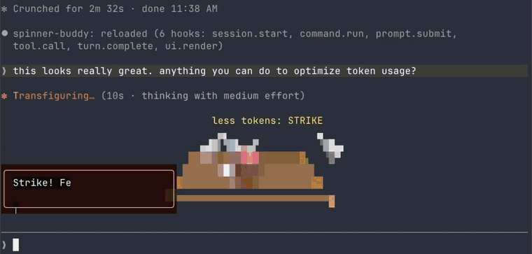

# claude-toons

Little animated cartoons of what Claude is doing, drawn under the spinner in
Claude Code while it works. Clawd, the Claude Code mascot, stars in every
scene, and the scene follows the work: tests become a castle siege, a bug hunt
becomes a safari, a long build becomes a rocket on the pad.



An independent project, not affiliated with or endorsed by Anthropic.

## What it costs

**On default settings, about 1 to 3% on top of what Claude Code already uses.**

Most scenes come from a library of 138 ready-made scenes that ship with the
plugin and cost nothing. A model is asked to draw a fresh scene only when you
start a task or something fails, and at most once a minute. Each of those
costs about 2 to 4 cents at API prices.

The range depends on how you work. Long tasks land near 1%, because one fresh
scene covers minutes of Claude's work. Rapid short back-and-forth lands near
3%, because nearly every message starts a task. These figures assume Claude
Code itself runs on Opus. On a cheaper model the share is larger.

The requests use your Claude Code login and nothing else. On a subscription
they count toward your plan's usage limits like any other Claude use. On an
API key they're billed to that key. Nothing is spent while Claude is idle or
the cartoons are hidden.

The "Scenes" setting picks where scenes come from:

| Scenes | Extra on top of Claude Code |
|---|---|
| Ready-made only | Nothing. No requests are made. |
| Mix (default) | ~1–3% |
| Fresh only, a new scene every 15 seconds | ~5–10% |
| Fresh only, as fast as possible | ~15–25% |

`/toons settings` shows what the cartoons have actually cost you, next to
what Claude's own work costs, once there's enough to measure.

## Install

You need Claude Code with plugin hook modules, an early-access feature. This
was built on version 2.1.287.

1. Clone the repo:

   ```sh
   git clone https://github.com/achimala/claude-toons ~/src/claude-toons
   ```

2. Try it for one session:

   ```sh
   claude --plugin-dir ~/src/claude-toons
   ```

   Give Claude any task. The cartoons appear under the spinner while it works.

3. To load it in every session, add the folder to the `env` block of
   `~/.claude/settings.json` with its full path, then restart Claude Code:

   ```json
   {
     "env": {
       "CLAUDE_CODE_PLUGIN_DIRS": "/Users/you/src/claude-toons"
     }
   }
   ```

To update, run `git pull` in the folder. A running session picks up the change
on its own. To uninstall, remove the folder from `CLAUDE_CODE_PLUGIN_DIRS` and
delete it.

**Nothing shows up?** Run `claude --debug` and look for a `toons` line. If it
says hook modules are turned off, your Claude Code doesn't have the feature
yet. Cartoons only appear while Claude is working, and only in the terminal.

## Using it

- **`/toons`** shows or hides the cartoons, even mid-task. Hidden means no
  scenes are requested at all. The choice is remembered across sessions.
- **`/toons settings`** opens the settings and the cost figures. The same
  settings are in `/config` under "Toons".

| Setting | What it does |
|---|---|
| Scenes | "Ready-made only" is free. "Mix", the default, adds fresh scenes for news. "Fresh only" draws every scene new, at several times the cost. |
| Scene styles | A mix, or only 3D, pixel art or text art, or everything but 3D. |
| Director model | The model that draws fresh scenes. Sonnet by default. Haiku is cheaper, Opus is more inventive. |
| New scene | How often fresh scenes may be requested, in "fresh only". |
| Director thinks | Lets the model think before each fresh scene. Off by default, since thinking costs more. |

## License

MIT. See [LICENSE](LICENSE).
